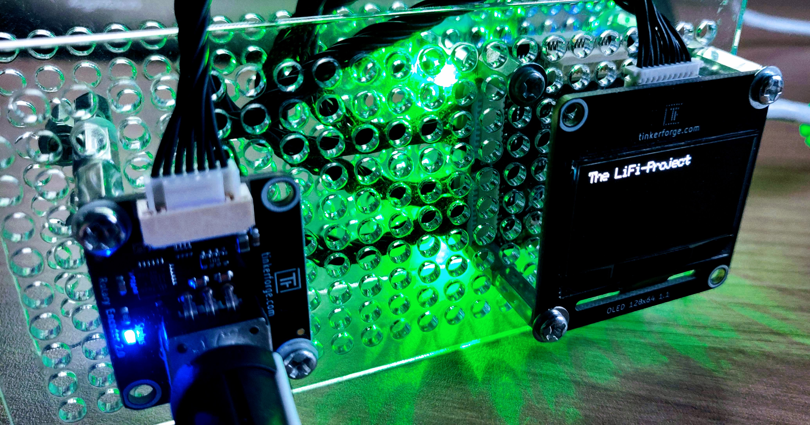

# The LiFi-Project

<figure><figcaption>
An early LiFi prototype device.
</figcaption></figure>

## The project setup

The term [LiFi](https://en.wikipedia.org/wiki/Li-Fi) is short for Light-Fidelty and describes a technology to transmit information through the use of light. LiFi uses the visible light spectrum to create a signal using simple devices such as light-emitting diodes (LEDs). The light is received by a photodetector that can sense the light emitted by the LED. Through variation of the light's characteristic over time, be it the wavelength or the illuminance, we can encode and transmit data.

You are part of an interdisciplinary research & development (R\&D) team of engineers at a high-tech company that develops and produces robots for applications in food & agriculture. The company sees great potential in the LiFi technology for the fast and secure exchange of information between robots and other peripherals. A special use case is environments where radio frequency signals disturb the microorganisms or other sensitive electronic devices.

Your task is to develop a working prototype for a LiFi communication device that can be built into the company's next generation of robots. The two main components of the device are a [small LED](https://www.tinkerforge.com/en/doc/Hardware/Bricklets/RGB\_LED\_V2.html) and a [color sensor](https://www.tinkerforge.com/en/doc/Hardware/Bricklets/Color\_V2.html). The LED can light up in any of the roughly 16 million colors of the RGB coding system. The color sensor can measure the intensity of the 3 RGB color channels as well as the brightness of the light. A so-called [Master Brick](https://www.tinkerforge.com/en/doc/Hardware/Bricks/Master\_Brick.html) is responsible for controlling both components.

## An engineering problem

The LiFi-project is a typical engineering problem. It involves hardware and software, and the goal is  to combine both to solve a problem. The key question of this project is

* **Can we transmit information using an LED and a color sensor?**&#x20;

Assuming we can, then the following questions arise:

* **How fast can we transmit information with this setup?**
* **How reliable is the data transfer?**
* **Over what distance can we transfer data?**
* **Under what environmental conditions can we transfer data?**

The major constraint we have is that we have to solve these questions with hardware that is given to us. This includes an LED, color sensor, a rotary encoder with button functionality, and a 128 by 64 pixel OLED display.

In this project, you will find the answers to all the above questions! Curious? Let's go!
