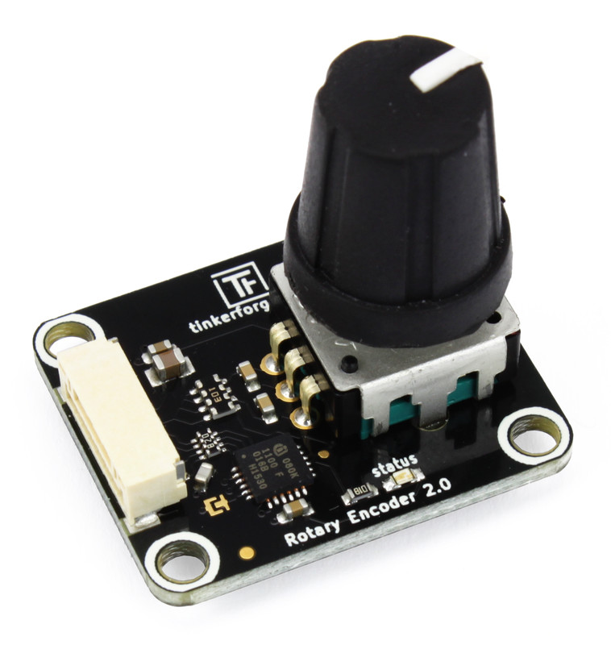

# Troubleshooting

In the following, I aim to address frequent errors and their solutions when running a Python program from a terminal. There is a great chance you might encounter the one or the other in your first attempts.

## File Not Found

You might see the following message after you type `python <filename.py>` and hit ENTER:

```
can't open file '...\rgb_led.py': [Errno 2] No such file or directory
```

Python is telling you it can't find the file you specified, in this case `rgb_led.py`. In most cases, this is because you are not in the same directory as the file you are trying to run. The current directory is displayed in your terminal, usually right before the cursor:

<figure><figcaption></figcaption></figure>

In my example, I am in the directory `C:\code\LiFi-code`, and if I run `python rgb_led.py`, the Python command will assume the file is in the current directory, which it isn't. It is one folder below in `examples\rgb_led.py`. You can check this on Windows by typing the command `dir`, and on Mac and Linux the equivalent command is `ls`. Both will print all files and directories that are in the current directory.&#x20;

So to solve the above problem, there are three possible solutions:

1. Change to the directory `examples` where the file `rgb_led.py` is saved. On Windows, Mac, and Linux, you can use the `cd` command for that. If you need help with this simple command, ask Google or the chatbot of your choice.
2. Give Python the full relative path. Instead of typing `python rgb_led.py` , you could specify the subfolder directly: `python examples\rgb_led.py`.&#x20;
3. Move the file `rgb_led.py` to the directory you are currently in. This makes sense if you accidentally saved a file in the wrong location on your computer. In this case, the file is in the right directory.

## Missing or Wrong UID

Your program runs, but after a couple of seconds, you get a rather large error message with this line at the end?&#x20;

```
tinkerforge.ip_connection.Error: Did not receive response for function 255 in time (-1)
```

This usually means that you entered a wrong UID in your `constants.py` and the program can't connect to the LED. Double-check your LED's UID using the Brick Viewer, and correct any misspellings.
