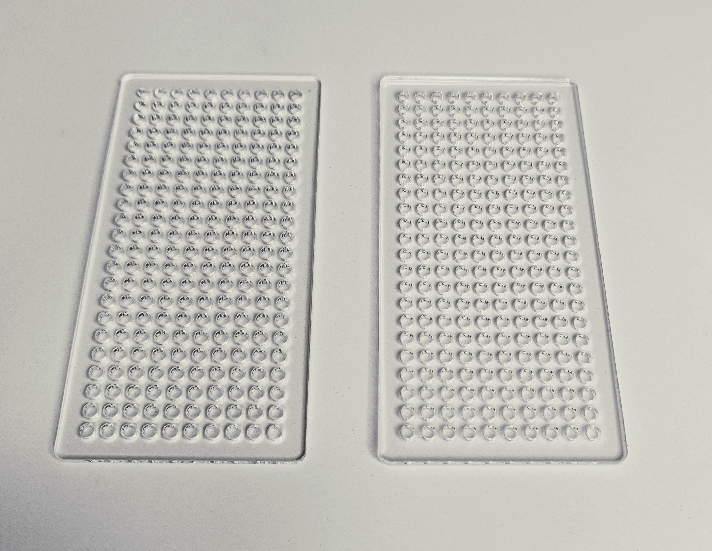
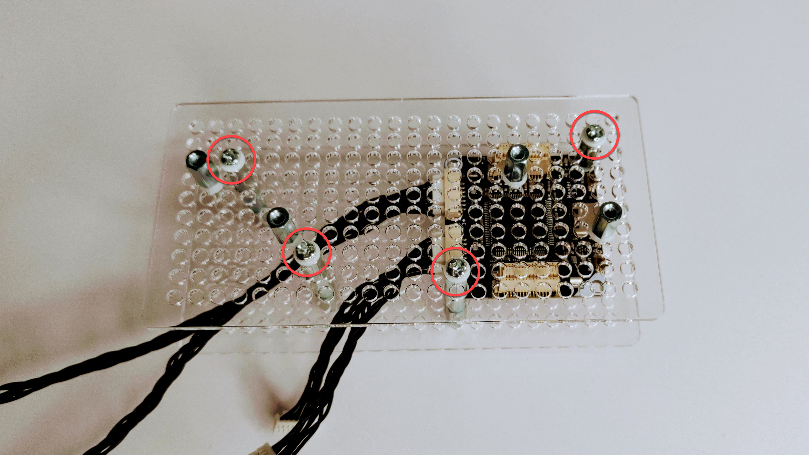

# Hardware Assembly

Summary

In this lesson, you'll learn:

* Which hardware components are required for the LiFi-project.
* How the components must be assembled for the LiFi hardware prototype.

This lesson is relevant for the [Exercise 1: Ready, Set, Smoke](https://github.com/winf-hsos/lifi-exercises/raw/main/exercises/01\_exercise\_ready\_set\_smoke.pdf).

<figure><figcaption>
The assembled and wired LiFi prototype.
</figcaption></figure>

## List Of Components

The LiFi hardware prototype contains the following components:

* 1 x [Master Brick 3.1](https://www.tinkerforge.com/en/shop/bricks/master-brick.html)
* 1 x [RGB LED Bricklet 2.0](https://www.tinkerforge.com/en/shop/rgb-led-v2-bricklet.html)
* 1 x [Color Bricklet 2.0](https://www.tinkerforge.com/en/shop/color-v2-bricklet.html)
* 1 x [OLED 128x64 Bricklet 2.0](https://www.tinkerforge.com/en/shop/oled-128x64-v2-bricklet.html)
* 1 x [Rotary Encoder Bricklet 2.0](https://www.tinkerforge.com/en/shop/rotary-encoder-v2-bricklet.html)
* 3 x [Bricklet Cable 15 cm (7p-7p)](https://www.tinkerforge.com/en/shop/bricklet-cable-15cm-7p-7p.html)
* 1 x [Bricklet Cable 6 cm (7p-7p)](https://www.tinkerforge.com/en/shop/accessories/cable/bricklet-cable-6cm-7p-7p.html)
* 1 x [USB-A to USB-C Cable 100 cm](https://www.tinkerforge.com/en/shop/accessories/cable/usb-a-to-usb-c-cable-100cm.html)
* 2 x [Mounting Plate 22x10](https://www.tinkerforge.com/en/shop/accessories/mounting/mounting-plate-22x10.html)
* 4 x [Mounting Kit 12 mm](https://www.tinkerforge.com/en/shop/accessories/mounting/mounting-kit-12mm.html)

Make sure your LiFi kit contains all components in the required amount before you proceed with the following instructions.

## Assembly Instructions

### 1. Parts Overview

The image below gives an overview of what's in the hardware kit. We'll need all of that for the assembly of the LiFi-prototype in the subsequent steps.

**Update**: In contrast to the image below, in your hardware kit, there are only 4 mounting kits (the small plastic bags with screws in it) instead of 6, and the 7-pole cables have different lengths (1 x 6 cm and 3 x 15 cm, instead of 4 x 15 cm as shown in the image).

<figure><figcaption>
The hardware and screwdriver required to assemble to LiFi-prototype.
</figcaption></figure>

### 2. Remove Foil From Mounting Plates

We'll now prepare **the mounting plates** for assembly. Gently remove the blue foil that protects the surface from scratches.

<figure><figcaption>
The Mounting Plate 22x10 with the foil still on.
</figcaption></figure>

<figure><figcaption>
The Mounting Plate 22x10 with the foil removed.
</figcaption></figure>

### 3. Attach Spacers To Mounting Plate 1

Add **four 10 mm spacers** on the first mounting plate in exactly the positions shown in the image below. Make sure you use the smaller 10 mm spacers with screw threads on both sides. Attach screws from the back of the mounting plate and add a small plastic ring to each screw (see below).

<figure><figcaption>
The 10 mm spacers attached to the mounting plate (top view).
</figcaption></figure>

<figure><figcaption>
The back of the mounting plate. You can clearly see the screw and the plastic ring to protect the plate.
</figcaption></figure>

### 4. Attach Spacers To Mounting Plate 2

Now, we add **four 10 mm spacers** to the second mounting plate in the configuration shown below. Note that this time, instead of screws, we use **four 12 mm spacers**, which have a screw on one side, and connect them to the 10 mm spacers from the back of plate 2. Do not use any plastic rings in this step.

<figure><figcaption>
The 10 mm spacers attached via the 12 mm spacers that have a screw on one side (plate 2).
</figcaption></figure>

### 5. Install Master Brick 3.1&#x20;

Next, we mount the **Master Brick 3.1** to the **mounting plate 2** using two of the 10 mm spacers on the right side from the previous step. We use **two 12 mm spacers** with screws to fix the Master Brick. Make sure you use **two plastic rings** to protect the Master Brick's board.

In the same step, add **two 12 mm spacers** to the 10 mm spacers on the left side as well. Use **two nuts (!)** (see image  below) here instead of the plastic rings.

<figure><figcaption>
Use two nuts as shown in the image to achieve the correct spacing.
</figcaption></figure>

<figure><figcaption>
Use a 12 mm spacer with a plastic ring to fix the Master Brick.
</figcaption></figure>

### 6. Plug In 7-Pole Cables

Now that the Master Brick is tightly attached to the mounting plate, we can add the 7-pole cables for connecting the other devices to the Master Brick later on. It is important which cables, 6 cm or 15 cm, you attach to which socket: In the image below, the two sockets facing the bottom of the picture must be equipped with the **2 x 6 cm 7-pole cables**. Plug in the **2 x 15 cm 7-pole cables** in the sockets facing the top of the picture.

<figure><figcaption></figcaption></figure>

### 7. Connect Mounting Plates

Now, you must put the first mounting plate on top of the second as shown below. Fix the plate with **four screws** and add **plastic rings** to protect the mounting plate's surface.

<figure><figcaption>
The two mounting plates are connected with four screws.
</figcaption></figure>

### 8. Install OLED 128x64 Display

Use **two screws with plastic rings** and attach the **OLED 128x64 Display** to the right pair of spacers on mounting plate 2. Make sure the display's socket faces the side of the mounting plate where you plugged in the 6 cm 7-pole cables during the previous step (north in this image).

<figure><figcaption>
The OLED display gets fixed to the right spacer pair of mounting plate 2. Make sure the display's socket faces the side of the mounting plate where you plugged in the 6 cm 7-pole cables (north in this image).
</figcaption></figure>

### 9. Install Rotary Encoder

Next to the OLED display, install the **Rotary Encoder Bricklet** using **two screws with plastic rings**.  Make sure the rotary encoder's socket faces the same direction as the OLED display (north in this image).

<figure><figcaption>
Attach the Rotary Encoder to the left pair of spacers. Notice the direction of the socket, which must be the same as for the OLED display.
</figcaption></figure>

### 10. Install Color Sensor and LED

Turn around the device so that you are facing mounting plate 1 with the four 10 mm spacers we installed in step 3. These become now equipped with the **Color Bricklet 2.0** (left pair of spacers) and the **RGB LED Bricklet 2.0** (right pair of spacers) using **four screws and plastic rings** in total. Make sure the sockets of both devices point upward and in the same direction as the sockets of the OLED display and rotary encoder.

<figure><figcaption></figcaption></figure>

<figure><figcaption>
The LiFi-prototype viewed from the top. Make sure all sockets point upward.
</figcaption></figure>

### 11. Connect Devices With 7-Pole Cables

Finally, we connect the four devices (OLED display, rotary encoder, color sensor, LED) to the Master Brick using the four 7-pole cables. Make sure you attach the OLED display to the 6 cm 7-pole cable. The color sensor, LED and the rotary encoder must be connected using the 15 cm 7-pole cables.

<figure><figcaption></figcaption></figure>

That's it! You have successfully completed the assembly of the LiFi hardware prototype. For communication between two robots, the color sensor and the LED will be facing a second LiFi hardware device in another robot. That way, the first robot's color sensor is facing the other robot's LED and vice versa.

However, for developing the required software in this course, it can be an extra barrier to require two LiFi hardware prototypes. Luckily, the prototype can be easily adjusted to communicate with itself. We'll do this in the last step.

### 12. Mount the LED in Front Of The Sensor

In this last step, you mount the RGB LED 2.0 to the Color Sensor so that the LED faces the sensor. To achieve this, remove the two screws that hold the color sensor and replace them with **two 12 mm spacers**. Add **four more 12 mm spacers**, two on each corner. This gives us a good distance for the LED's light to shine on the color sensor (not too close and not too far away). Finally, fix the RGB LED Bricklet with the two screws and two plastic rings it was previously fixed. Place the LED so that the light faces the sensor (!).&#x20;

<figure><figcaption>
Add two stacks of three 12 mm spacers on top of the color sensor.
</figcaption></figure>

<figure><figcaption>
Move the LED and attach it to the new set of spacers. Make sure the LED faces the color sensor.
</figcaption></figure>

<figure><figcaption>
The distance of the 3 spacers is a good configuration for the LED and the color sensor.
</figcaption></figure>

Alright, now we can move on to install and configure the software part of our project. In the next section, we'll set up our [development environment](development-environment.md).
