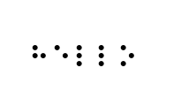
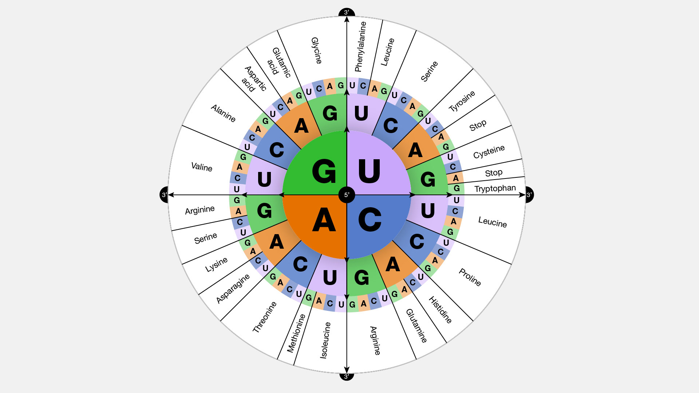

# Code Systems

<details>

<summary>Summary</summary>

In this section, you'll learn:

* How colors can be specified using a code system called the <mark style="background-color:green;">**RGB code.**</mark>
* Why the RGB code can represent 16,777,216 colors.
* What a code system is and what it is made of.
* How Morse code and other examples are code systems that originated before the digital computer revolution and have nothing to do with digitalization at all.

This lesson is relevant for [Exercise 2: Logic With The LED](https://winf-hsos.github.io/lifi-exercises/exercises/02_exercise_logic_with_the_led.pdf).

</details>


## The RGB Code

In the previous section about [the-led.md](../setting-the-scene/the-led.md "mention"), we briefly touched the RGB code and used it to set the LED's color to green. We did this using a function from the Tinkerforge <mark style="background-color:green;">**API**</mark> called `set_rgb_value`. When calling this function, we passed three numbers to it:

```python
led.set_rgb_value(0, 255, 0)
```

### The RGB Code In A Nutshell

It is now time to understand what these three numbers mean and what values we can assign to each of them. The short answer is: the numbers belong to the RGB code, which is a <mark style="background-color:green;">**code system**</mark> that uses 3 <mark style="background-color:green;">**bytes**</mark> to represent one of roughly 16 million colors. The abbreviation "RGB" stands for the three colors **r**ed, **g**reen, and **b**lue. The RGB code specifies the intensity for each of these three basic colors to create the desired resulting color. The RGB code reserves one byte for each of the three basic colors, hence 3 bytes in total. Knowing that, we understand why the above code line produces a pure green color. All basic colors are set to zero, except green, which is set to 255, the largest possible number we can store in one byte.

That was a lot! Let's unpack this.


### Why 16 Million Colors?

With the RGB code, we can represent exactly $$16,777,216$$ different colors. The reason is simple mathematics: a color in the RGB code is defined by a mix of the three basic colors red, green, and blue. For each basic color, we can specify an intensity between 0 (none of that color) and 255 (full intensity). This makes 256 possible values for one basic color. Because we can combine all possible values of the three basic colors, and each results in a different color, the RGB code can represent

$$
256 \times 256 \times 256 = 16,777,216
$$

different colors. But why is it that for each basic color, we can specify the intensity between 0 and the seemingly arbitrary upper limit of 255? The answer lies is the byte.

### What Is A Byte And Why 255?

Simply put, a byte is a sequence of eight digits that can be either 0 or 1. A digit that can either be 0 or 1 is called a <mark style="background-color:green;">**bit**</mark>, which is short for <mark style="background-color:green;">**binary digit**</mark>. So eight bits equal one <mark style="background-color:green;">**byte**</mark>.

So, what about the 255? Well, 255 is the largest <mark style="background-color:green;">**decimal number**</mark> we can represent with one byte (or 8 bits). We'll discuss the [binary-numbers.md](binary-numbers.md "mention") in more detail later on, but here is the quick explanation: If we only had one bit, how many numbers could we represent with it? That's simple, only two: 0 and 1. But what if we had two bits? How many numbers can we represent then? We can figure this out by calculating the number of permutations we can create from two digits with two possible values: $$2 \times 2 = 4$$. What if we had three bits? Well: $$2 \times 2 \times 2 = 8$$. In general, for $$n$$ bits, we can calculate the number of combinations as $$2^n$$. Thus, the answer for eight bits (or one byte) is $$2^8 = 256$$. That means, we can represent numbers between 0 and 255, which makes 256 different values. And since the RGB code uses one byte for each of the three basic colors, the intensity can be a number between 0 and 255.

### What Does The Hashtag Mean?

Occasionally, you see colors being specified in a format that starts with a hashtag symbol followed by 6 numbers or letters. This is the RGB code expressed as a <mark style="background-color:green;">**hexadecimal number**</mark>. The <mark style="background-color:green;">**hexadecimal system**</mark> is often used to express the value of a byte because in this system we can write one byte with only two symbols. This makes it very compact.&#x20;

The color "#00FF00" corresponds to full green: the first two "00" digits represent the first byte, which in the RGB code stands for the intensity of red, which is zero here. The next two digits "FF" stand for the intensity of green, and "FF" is the largest possible value for a two-digit hexadecimal number. "FF" is 255 in decimal. The last pair "00" is for the intensity of blue, which is also zero.

You will learn more about the hexadecimal system when we introduce [binary-numbers.md](binary-numbers.md "mention") alongside the general idea of <mark style="background-color:green;">**number systems**</mark>.

## ASCII Code


## Other Code Systems

Although in the LiFi-project, we use code systems in the context of digital computers, code systems do not necessarily have any relation to ones and zeroes whatsoever. There were code systems invented long before the digital computer.

### Barcodes

A barcode is a way to represent information using a series of lines and spaces of varying widths and distances. The bars and spaces are arranged in a specific pattern that is read by a barcode scanner, which translates the pattern into a code that can be understood by a computer.

Each barcode represents a unique set of numbers, known as a Universal Product Code (UPC). These codes are used to identify products in stores, warehouses, and other settings. When a barcode scanner reads the pattern on a barcode, it retrieves the corresponding UPC from a database and provides information about the product, such as its name, price, and inventory status.

Barcodes are commonly used in a variety of industries, including retail, healthcare, and logistics. They provide a cheap, fast and accurate way to collect and track data.

<figure><figcaption><p>An example of a barcode encoding an EAN-13.</p></figcaption></figure>

In a barcode, a line or space can be either 1, 2, 3 or 4 units wide. The optical scanner can distinguish the widths and decode the digit. One digit is always represented by alternating lines and spaces that make up a width of 7 units in total.


### QR Codes

QR codes, short for Quick Response codes, are two-dimensional barcodes that have gained significant popularity in the digital era due to their ability to store a large amount of data in a small, scannable space. Invented in 1994 by the Japanese company Denso Wave, QR codes were originally designed for tracking automotive components during manufacturing. However, their versatility and ease of use have led to widespread adoption across various industries and applications.

QR codes work by encoding data in a grid of black and white squares, which can be scanned using a smartphone or dedicated QR code reader. The data is then extracted and translated into a human-readable format, such as a URL, plain text, contact information, or even a Wi-Fi network's login credentials. This technology has proven especially useful in marketing, where businesses can share website links, promotional materials, or digital coupons with consumers through a simple scan. Additionally, QR codes can be found in applications such as mobile ticketing, product authentication, and even educational resources. By providing a quick and convenient means of accessing digital information, QR codes have become an essential tool in the digitalization landscape.

<figure><figcaption><p>An example of a QR-code. See where it takes you.</p></figcaption></figure>

### Braille Code

Braille is a system of raised dots that can be felt with the fingertips. It is used by people who are blind or visually impaired to read and write. Braille consists of six dots arranged in a pattern that represents a letter, number, or punctuation mark. The dots are arranged in two columns of three dots each, with each dot in a column numbered from one to three from top to bottom.

For example, the letter "A" is represented by a single dot in the upper-left corner of the cell, while the letter "B" is represented by dots in the upper left and lower left corners of the cell. The letter "C" is represented by dots in the upper right and lower left corners of the cell, and so on.

Here's an example of the word "hello" in braille (created with [https://www.brailletranslator.org](https://www.brailletranslator.org/)):

<figure><figcaption></figcaption></figure>

Each letter is represented by a combination of dots, and the letters are arranged in left-to-right order, just like in regular text.

### Genetic Code (DNA)

The genetic code is the set of rules that determines how nucleotide triplets (codons) in DNA and RNA encode the 20 standard amino acids that make up proteins. There are $$4^3 = 64$$ possible codons, but only 20 different amino acids to code for. This means that the code is degenerate, meaning that multiple codons can encode for the same amino acid. For example, the amino acid leucine can be coded for by six different codons: UUA, UUG, CUU, CUC, CUA, and CUG.

<figure><figcaption><p>The encoding of the 20 standard amino acids through triplets of nucleotide bases (codons). Source: <a href="https://www.genome.gov/">https://www.genome.gov</a></p></figcaption></figure>

The genetic code is read by cellular machinery called ribosomes, which are large molecular complexes made up of RNA and protein. The ribosome reads the codons in the messenger RNA (mRNA) and uses them to assemble a chain of amino acids in the correct order to make a protein. The process of assembling a protein from the genetic code is called translation.

The genetic code is universal, meaning that the same code is used by all living organisms on Earth. This is a testament to the fundamental importance of the genetic code for life as we know it. Even biology has agreed upon a code system.

### Music Notation

Anyone into making music? If so, you are using code systems fairly regularly. The system of music notation uses a set of five horizontal lines and four spaces, on which these symbols are placed. Each line and space represents a different pitch, and the symbols placed on them indicate the duration and timing of the note. For example, a solid black circle placed on the second line from the bottom represents a note played at a specific pitch and held for a specific length of time. The position of the note on the staff and the symbols used to represent it create a code that musicians can read to play the correct notes at the correct time. By combining different notes in specific patterns, musicians can create melodies and harmonies that make up the music we hear.

<figure><figcaption><p>Some random music notation generated by <a href="http://www.randomsheetmusic.com/">http://www.randomsheetmusic.com</a></p></figcaption></figure>

Notes are the basic symbols used to represent musical sounds in music notation. Different types of notes, such as whole notes, half notes, quarter notes, and so on, are used to represent different durations of sound. But the music notation system encodes more than just notes:

* Rests: Rests are symbols used to indicate periods of silence in music. They come in different durations that correspond to the different types of notes.
* Clefs: Clefs are symbols that are placed at the beginning of a musical staff to indicate the pitch range of the music. The most common clefs are the treble clef and bass clef.
* Time signatures: Time signatures are symbols that are placed at the beginning of a piece of music to indicate the meter or rhythm of the music. They consist of two numbers, one above the other, with the top number indicating the number of beats in each measure and the bottom number indicating the duration of each beat.
* Accidentals: Accidentals are symbols that are used to modify the pitch of a note. The most common accidentals are the sharp (#), flat (b), and natural (♮) signs.
* Dynamics: Dynamics are symbols that are used to indicate the volume or intensity of the music. Examples include p (piano, meaning soft), f (forte, meaning loud), and crescendo/decrescendo symbols that indicate a gradual increase or decrease in volume.

### Morse Code

Morse code is a system of communication that uses a series of short and long signals to represent letters, numbers, and punctuation. These signals can be transmitted using sound or light, such as through a telegraph, flashlight, or radio signal. Each signal in Morse code is known as a "dot" or a "dash", and they are combined to form the code for each letter or symbol.

For example, the letter "A" in Morse code is represented by a short signal (dot) followed by a long signal (dash), which is written as ".-" (dot-dash). The letter "S" is represented by three short signals (dots), which is written as "..." (dot-dot-dot). Spaces between letters are represented by short pauses, while spaces between words are represented by longer pauses.

Morse code is a useful system for communication in situations where speech or text-based messages may not be possible or practical. It was originally used for long-distance communication through telegraph lines, and later adapted for use in radio communication. Today, it is still used by some amateur radio operators and in certain specialized fields, such as aviation and emergency services.

<figure><figcaption><p>The international Morse code. Source: <a href="https://en.wikipedia.org/wiki/Morse_code">https://en.wikipedia.org/wiki/Morse_code</a> </p></figcaption></figure>

## Further reading

To explore this topic further, I recommend the following resources:

* Chapter One "Best Friends" from _Code: The Hidden Language of Computer Hardware and Software_ by Charles Petzold.
* Chapter Two "Codes And Combinations" from _Code: The Hidden Language of Computer Hardware and Software_ by Charles Petzold.
* [The Wikipedia article on Morse code](https://en.wikipedia.org/wiki/Morse_code)
