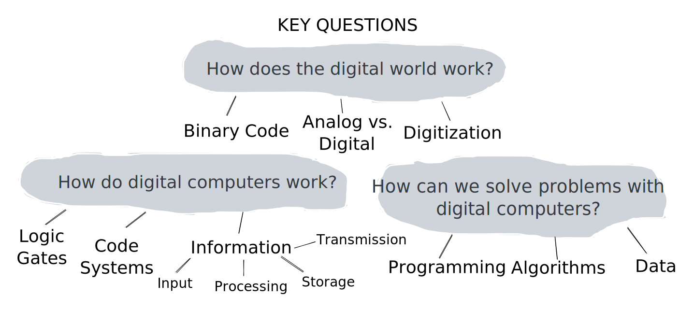

# Coding Text

Summary

In this lesson, you'll learn:

* ...
* ...

This lesson is relevant for [Exercise 6: Text Messages](https://winf-hsos.github.io/lifi-exercises/exercises/06\_exercise\_text\_messages.pdf).

## Designing a Code System

In the lesson about [measuring information](../speed-of-light/measuring-information.md), we learned a way to figure out how many bits we need to save or send a message with a certain message space. This means the symbols we have and how long our message is.

