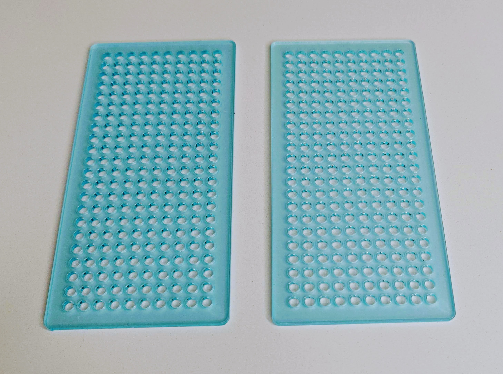
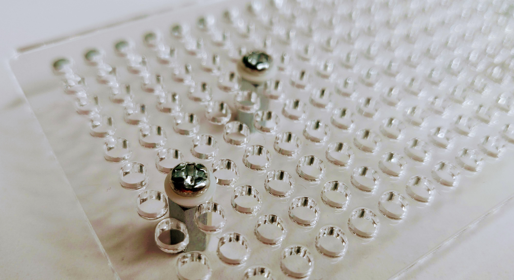

# 1 - Hardware Assembly


This section is relevant for [Exercise 1: Ready, Set, Smoke](https://github.com/winf-hsos/lifi-exercises/raw/main/exercises/01\_exercise\_ready\_set\_smoke.pdf).


## Summary

In this section, you'll learn:

* What hardware components are required for the LiFi-project.
* How the components must be assembled for the prototype device.

## List of components

The hardware kit contains the following components:

* 1 x [Master Brick 3.1](https://www.tinkerforge.com/en/shop/bricks/master-brick.html)
* 1 x [RGB LED Bricklet 2.0](https://www.tinkerforge.com/en/shop/rgb-led-v2-bricklet.html)
* 1 x [Color Bricklet 2.0](https://www.tinkerforge.com/en/shop/color-v2-bricklet.html)
* 1 x [OLED 128x64 Bricklet 2.0](https://www.tinkerforge.com/en/shop/oled-128x64-v2-bricklet.html)
* 1 x [Rotary Encoder Bricklet 2.0](https://www.tinkerforge.com/en/shop/rotary-encoder-v2-bricklet.html)
* 2 x [Bricklet Cable 15 cm (7p-7p)](https://www.tinkerforge.com/en/shop/bricklet-cable-15cm-7p-7p.html)
* 2 x [Bricklet Cable 6 cm (7p-7p)](https://www.tinkerforge.com/en/shop/accessories/cable/bricklet-cable-6cm-7p-7p.html)
* 1 x [USB-A to USB-C Cable 100 cm](https://www.tinkerforge.com/en/shop/accessories/cable/usb-a-to-usb-c-cable-100cm.html)
* 2 x [Mounting Plate 22x10](https://www.tinkerforge.com/en/shop/accessories/mounting/mounting-plate-22x10.html)
* 4 x [Mounting Kit 12 mm](https://www.tinkerforge.com/en/shop/accessories/mounting/mounting-kit-12mm.html)

## Assembly Instructions

### 1. Parts Overview

The image below gives an overview of what's in the hardware kit. We'll need all of that for the assembly of the LiFi-prototype.

**Update**: In contrast to the image below, in your hardware kit, there are only 4 Mounting Kits (the small plastic bags) instead of 6 and the 7-pole cables have different lengths (2 x 6 cm and 2 x 15 cm).

<figure><figcaption>
The hardware and screwdriver required to assemble to LiFi-prototype.
</figcaption></figure>

### 2. Remove Foil From Mounting Plates

We'll now prepare the Mounting Plates for assembly. Gently remove the blue foil that protects the surface from scratches.

<figure><figcaption>
The Mounting Plate 22x10 with the foil still on.
</figcaption></figure>

<figure><figcaption>
The Mounting Plate 22x10 with the foil removed.
</figcaption></figure>

### 3. Attach Spacers To Mounting Plate 1

Add 4 spacers on the first mounting plate in exactly the positions shown in the image below. Make sure you use the smaller 10 mm spacers with screw threads on both sides. Attach screws from the back of the mounting plate and add a small plastic ring to each screw (see below).

<figure><figcaption>
The 10 mm spacers attached to the mounting plate (top view).
</figcaption></figure>

<figure><figcaption>
The back of the mounting plate. You can clearly see the screw and the plastic ring to protect the plate.
</figcaption></figure>

### 4. Attach Spacers To Mounting Plate 2

Now, we add four 10 mm spacers to the second mounting plate in the configuration shown below. Note that this time, instead of screws, we use four 12 mm spacers which have a screw on one side. Do not use any plastic rings in this step.&#x20;

<figure><figcaption></figcaption></figure>

 

<figure><figcaption></figcaption></figure>

### 1. Mounting The Master Brick

In the first step, we mount the **Master Brick** to the first **Mounting Plate 22x10**. For that, we use the four of the **10 mm spacers** included in the **Mounting Kits**.&#x20;

