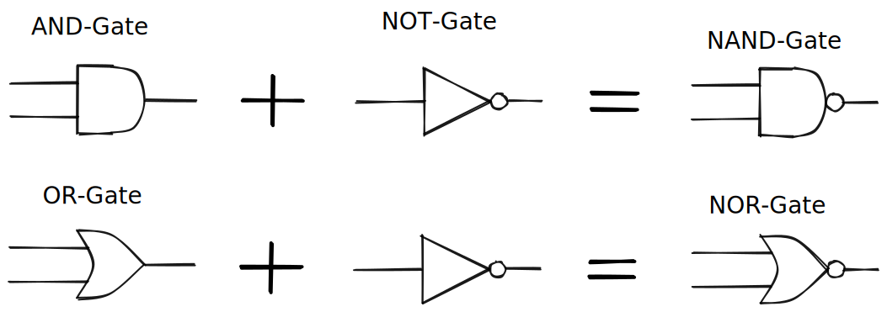

# 8 - The Rotary Encoder ⚡


## Summary

In this section, you'll learn:

* How to connect to the rotary encoder from a Python program.
* How to read the current value of the rotary encoder.
* How to get frequent updates about values changes of the rotary encoder.
* How to use the button functionality of the rotary encoder.
* What a callback function is and how it works


This section is relevant for [Exercise 3: The Human Operator](https://github.com/winf-hsos/lifi-exercises/raw/main/exercises/03\_exercise\_human\_operator.pdf).


## The Rotary Encoder

The rotary encoder is a typical control in many hardware applications. A user can turn the knob in both directions, which changes a value represented by the control. Turning it right increases the value, while turning it left decreases it. In addition, the rotary encoder is also a button. When the user presses the knob, this fires an <mark style="background-color:green;">**event**</mark>, and we can perform some action based on that event.

### Initialize The Rotary Encoder

As with all devices, we first need to establish a connection and store a reference to the device on a variable. We can do this with the following lines. I assume you have already created the IP-connection and executed `ipcon.connect()`:


```python
from tinkerforge.bricklet_rotary_encoder_v2 import BrickletRotaryEncoderV2
rotary = BrickletRotaryEncoderV2("xxx", ipcon)
```


Make sure you replace the UID with [your device's UID](the-led.md#how-to-get-a-devices-uid) before you go any further in this section.&#x20;

### Reading The Current Value

Once we have a reference to the device stored on the variable `rotary`, we have access to the device's functions. To learn which functions the device has, we can consult the [official Python API documentation on the Tinkerforge website](https://www.tinkerforge.com/en/doc/Software/Bricklets/RotaryEncoderV2\_Bricklet\_Python.html).

Here we find that the Rotary Encoder Bricklet 2.0 has a function called `get_count`, which, according to the documentation, "_returns the current count of the encoder_". Let's give it a try:

```python
count = rotary.get_count()
print(count)
```

### Getting New Values In Real-Time

We can read the rotary encoder's value at any time in our program with the `get_count` function (see above). But that means we have to determine when and how often we check for changes. If we want to be informed about all changes immediately, we can use so-called <mark style="background-color:green;">**callback functions**</mark>, a concept typically applied when working with sensors.



We can think of callback function like a phone number. Imagine you are awaiting an important package to be delivered to your home, but you cannot be there to receive it in person. Luckily, your roommate offered to accept it on your behalf. Because you want to get the information when the package has arrived right away, you ask your roommate to call you on your cellphone right after the delivery. You ask her to call you (back).

Callback functions work the same way. Instead of a package delivery, it is the device's events we wish to be notified of, such as when someone turns the rotary encoder or presses it. Instead of our phone number, we pass (or register) a function to call. We call this function the callback function.

In the code below, we use the `register_callback` function to specify the event and the callback function to execute when that event happens (line 6). We pass both as arguments:


```python
rotary = BrickletRotaryEncoderV2(UID, ipcon)

def count_changed(count):
    print(count)

rotary.register_callback(BrickletRotaryEncoderV2.CALLBACK_COUNT, count_changed)
rotary.set_count_callback_configuration(10, True, "x", 0, 0)
```


The event is passed as a constant `CALLBACK_COUNT` from the `BrickletRotaryEncoderV2` object. As we can read in the [API documentation](https://www.tinkerforge.com/en/doc/Software/Bricklets/RotaryEncoderV2\_Bricklet\_Python.html#rotary-encoder-v2-bricklet-python-callbacks), this event can be used to be notified about the current value (count) of the rotary encoder. To be notified only when someone turns the rotary encoder in either direction, and thus changes the value, we instruct the rotary encoder by passing a callback-configuration (line 7). In the example above, we wish to be updated in a 10 ms interval (1st parameter), but only if the value has changed (2nd parameter = `True`). The "x" means we do not specify a threshold, and the two zeroes are placeholders for the min and max values if we actually wanted to specify a threshold.

The callback function `count_changed` must be defined before the callback registration. In the example, the function simply prints the current value to the console.

## Is This A Sensor?

We said earlier that we can classify most devices into two groups: <mark style="background-color:green;">**sensors**</mark> and <mark style="background-color:green;">**actuators**</mark>. So, what is the rotary encoder?

We could make the argument that controls like the rotary encoder are in fact sensors. What sensors have in common is that they _sense_ something from the real, analog world. They often do this by measuring a property that acts as a proxy. For example, a specific type of temperature sensor measures the electric current flowing through a piece of metal. Knowing that the resistance of the metal changes with temperature and how, which changes the current flowing as well, we can infer the temperature from the measured current.&#x20;

What about the rotary encoder? We could analogously say that it measures the force applied to it along with the force's direction and uses it as a proxy for determining whether the value should go up or down. Or whether the user's intention was a button press. In that sense, the rotary encoder measures some form of energy (directed force) and is therefore a sensor.

It does not classify as an actuator because it cannot act in the real world in any way.

## Further Reading

* [Python API documentation for the Rotary Encoder Bricklet 2.0](https://www.tinkerforge.com/de/doc/Software/Bricklets/RotaryEncoderV2\_Bricklet\_Python.html#api)
