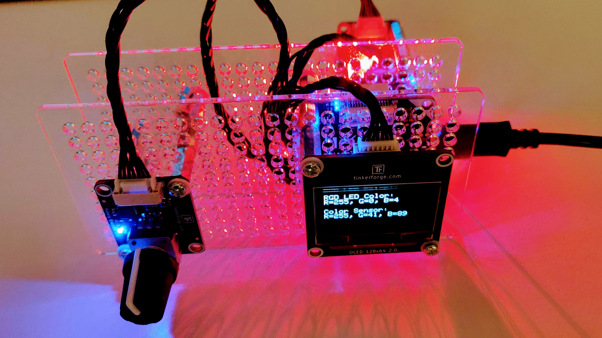

# 3 - Smoke Test ⭐

<figure><figcaption><p>The LiFi prototype while running the program-based smoke test.</p></figcaption></figure>

## Summary

In this section, you'll learn:

* How you can test the hardware components required for the LiFi-project.
* How the Brick Viewer works and how you can test the hardware components with it.
* What a smoke test is in engineering and why it's important.


This section is relevant for [Exercise 1: Ready, Set, Smoke](https://github.com/winf-hsos/lifi-exercises/raw/main/exercises/01\_exercise\_ready\_set\_smoke.pdf).


## What does a smoke test do?

The term <mark style="background-color:green;">**smoke test**</mark> in industrial engineering and software development describes the attempt to run a new system for the first time to see whether there are any major issues. The term 'smoke test' likely originated in the plumbing industry, where smoke was blown into a new pipe system to detect any leaks. For us, the smoke test means that we connect the hardware stack to a computer and test whether all components are working as expected. For this purpose, we can use the [Brick Viewer from Tinkerforge](https://www.tinkerforge.com/en/doc/Software/Brickv.html), which we installed in the [previous section](development-environment.md). Or we can use the Tinkerforge Python <mark style="background-color:green;">**API**</mark> and perform a smoke test from a program.

We'll perform two smoke tests in this section:

1. Connect to the hardware kit from the Tinkerforge Brick Viewer and test the device's functions.
2. Connect to the hardware kit from a Python program and test each device's individual functions as well as their interactions.

The tests give us confidence that all devices are intact, everything is wired correctly, all the identifiers were collected properly, and our development environment is installed and configured. If the test result is positive, that is.

## The UI-Based Smoke Test

We perform the first smoke test using the Brick Viewer software from Tinkerforge. You should have installed this software [in the previous section](development-environment.md#brick-viewer-and-brick-daemon), along with the Brick Daemon. Both are required for this smoke test to work.

To perform the UI-based smoke test, follow these steps:

### 1. Open Brick Viewer And Connect

Open the Brick Viewer software on your computer. On Windows, I find it easiest to type "Brickv" in the search field. You should also find it somewhere in your start menu. Once the software is open, check the left-hand side and find the host and port settings. They should look as follows.

<figure><figcaption><p>The Brick Viewer on start-up.</p></figcaption></figure>

If the host is "localhost" and the port is the default of 4223, you can click the large "Connect" button above it. Make sure you connect your hardware kit to your computer using the 1m USB cable first.

### 2. Check If All Devices Were Found

If the connection was successful, you see a list of connected devices in the Brick Viewer's main area. The list should look very similar to the one in the screenshot, except for different values in the UID-column. The position of each device in the list can also differ, this depends on into which socket you plugged them during [hardware assembly](hardware-assembly.md). The firmware version in the last column could also be slightly different, depending on when you take this course.

<figure><figcaption><p>The Brick Viewer shows a list of connected devices after a connection is established.</p></figcaption></figure>

## The Program-Based Smoke Test

The following code contains the full smoke test for our program-based version. It looks quite overwhelming for our first program, doesn't it? But don't worry: It looks intimidating now, but by the end of this project, you can explain every single line. You can consider this a goal for this course.&#x20;

For now, we will only run the code to see how the components work and interact from a Python program. We will briefly try to understand parts of the code, but we are not shooting at the whole program (yet).

<details>

<summary>Full code for the program-based smoke test</summary>


```python
import constants
import sys
from time import time, sleep

from colorama import just_fix_windows_console
from colorama import Fore, Back, Style
just_fix_windows_console()

from tinkerforge.ip_connection import IPConnection
from tinkerforge.brick_master import BrickMaster
from tinkerforge.bricklet_rgb_led import BrickletRGBLED
from tinkerforge.bricklet_rotary_encoder_v2 import BrickletRotaryEncoderV2
from tinkerforge.bricklet_color_v2 import BrickletColorV2
from tinkerforge.bricklet_oled_128x64 import BrickletOLED128x64

ipcon = IPConnection() # Create IP connection
ipcon.connect(constants.HOST, constants.PORT) # Connect to brickd

# Create device instances
led = BrickletRGBLED(constants.UID_RGB_LED, ipcon)
rotary = BrickletRotaryEncoderV2(constants.UID_ROTARY_ENCODER, ipcon)
oled = BrickletOLED128x64(constants.UID_OLED_DISPLAY, ipcon)
color = BrickletColorV2(constants.UID_COLOR_SENSOR, ipcon)

def update_oled_with_rgb_color(r, g, b):
    # Write current RGB LED's color to the OLED display
    oled.write_line(0, 0, "RGD LED Color:".ljust(26))
    oled.write_line(1, 0, f"R = {r}, G = {g}, B = {b}".ljust(26))

def update_oled_with_color_measurement(measured_r, measured_g, measured_b):
    oled.write_line(3, 0, "Color Sensor:".ljust(26))
    max_color_intensity = 65535
    oled.write_line(4, 0, f"R = {measured_r / max_color_intensity * 255:.0f}, G = {measured_g / max_color_intensity * 255:.0f}, B = {measured_b / max_color_intensity * 255:.0f}".ljust(26))

# Get the current color value of the RGB LED Bricklet
current_rgb_colors = led.get_rgb_value()
update_oled_with_rgb_color(current_rgb_colors.r, current_rgb_colors.g, current_rgb_colors.b)

# Get and reset the current count for the Rotary Encoder Bricklet
rotary.reset()
current_rotary_count = rotary.get_count(reset=False)

# Remember which color is currently controlled by the Rotary Encoder Bricklet (0 = "red", 1 = "green", 2 = "blue")
current_controlled_rgb_color_index = 0

# Set a callback function for the Rotary Encoder Bricklet
def rotary_changed_callback(count):
    if count == 0:
        return
    
    # Get the current color from the RGB LED
    current_rgb = led.get_rgb_value()
    current_rgb_list = [current_rgb.r, current_rgb.g, current_rgb.b]

    # Calculate the new RGB color from the Rotary Encoder's count
    global current_controlled_rgb_color_index
    current_rgb_list[current_controlled_rgb_color_index] += count

    if current_rgb_list[current_controlled_rgb_color_index]  > 255:
        current_rgb_list[current_controlled_rgb_color_index] = 255
    elif current_rgb_list[current_controlled_rgb_color_index] < 0:
        current_rgb_list[current_controlled_rgb_color_index] = 0

    led.set_rgb_value(current_rgb_list[0], current_rgb_list[1], current_rgb_list[2])
    update_oled_with_rgb_color(current_rgb_list[0], current_rgb_list[1], current_rgb_list[2])

    rotary.get_count(True)

def rotary_pressed():
    global current_controlled_rgb_color_index
    time_pressed = time()
    
    while rotary.is_pressed():
        sleep(0.01)
    
        duration_pressed = time() - time_pressed
        if duration_pressed >= 2:
            led.set_rgb_value(0, 0, 0)
            update_oled_with_rgb_color(0, 0, 0)
            return

    current_controlled_rgb_color_index += 1
    if current_controlled_rgb_color_index > 2:
        current_controlled_rgb_color_index = 0

def rotary_released():
    pass   

rotary.register_callback(BrickletRotaryEncoderV2.CALLBACK_COUNT, rotary_changed_callback)
rotary.set_count_callback_configuration(10, True, "x", 0, 0)

rotary.register_callback(BrickletRotaryEncoderV2.CALLBACK_PRESSED, rotary_pressed)
rotary.register_callback(BrickletRotaryEncoderV2.CALLBACK_RELEASED, rotary_released)

# Set up callback functions for the Color Bricklet
def color_changed(r, g, b, c):
    update_oled_with_color_measurement(r, g, b)

# Turn the status LED off to avoid inteference
color.set_status_led_config(0)

color.register_callback(BrickletColorV2.CALLBACK_COLOR, color_changed)
color.set_color_callback_configuration(20, False)

input("Please hit enter to exit")

# Disconnect from Brick Daemon
ipcon.disconnect()
```


</details>

Running this code is a task during [your first exercise](https://github.com/winf-hsos/lifi-exercises/raw/main/exercises/01\_exercise\_ready\_set\_smoke.pdf). In the next section [programs.md](programs.md "mention"), we examine parts of the code a bit closer and introduce five concepts in programming. Don't worry, we will learn about each concept in more detail later on. The next section should give you a first overview of how the smoke test program works. Or any program you will ever encounter, for that matter.

##
