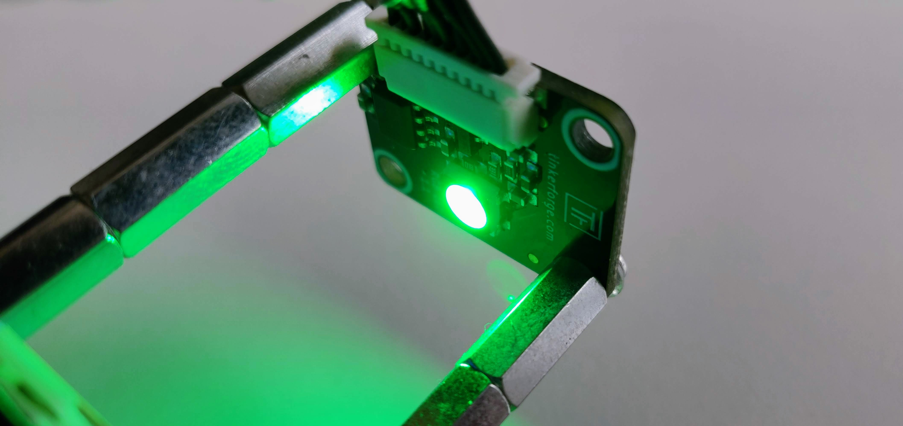

# 5 - The LED


This section is relevant for [Exercise 2: Logic with the LED](https://github.com/winf-hsos/lifi-exercises/raw/main/exercises/02\_exercise\_logic\_with\_the\_led.pdf).


## Summary

In this section, you'll learn:

* How to connect the LED from a Python program.
* How to set the LED to a specific color.
* How to turn off the LED.
* How LEDs work on a basic level

## Turning on the LED from Python

Let's dive right into some code. To start with, we will set the RGB LED to a green color and explain how that works from Python.

### Establish a connection

The connection to the LED is established through the Master Brick to which you connected the LED with a 7-pole wire in section [hardware-assembly.md](hardware-assembly.md "mention"). Tinkerforge uses the <mark style="background-color:green;">**IP-protocol**</mark> to connect to devices. This protocol may sound familiar to you, as it is also widely used on the internet to connect computers around the world.

Take a look at the code below, we'll explain in the following:


```python
HOST = "localhost"
PORT = 4223
UID_LED = "xxx" # Change to the UID of your RGB LED

from tinkerforge.ip_connection import IPConnection
from tinkerforge.bricklet_rgb_led import BrickletRGBLED

# Create IP-connection
ipcon = IPConnection()
ipcon.connect(HOST, PORT)

# Create LED object
led = BrickletRGBLED(UID_LED, ipcon)

# Set to full green color
led.set_rgb_value(0, 255, 0)

# Disconnect
ipcon.disconnect()
```


In summary, the code creates a new IP-connection (line 8) and connects using the host and port information (line 9) that we stored as <mark style="background-color:green;">**constants**</mark> (lines 1 & 2). In line 11, we create a new LED <mark style="background-color:green;">**object**</mark> by passing the device's <mark style="background-color:green;">**unique identifier (UID)**</mark> along with the IP-connection. Afterward, the <mark style="background-color:green;">**variable**</mark> `led` should hold a reference to our LED hardware device that is connected to our computer. With that reference, we can access one of the LED's main functionalities: setting its color to any vale using the <mark style="background-color:green;">**RGB code**</mark>. The RGB code will be addressed in detail in the next section about [code-systems.md](code-systems.md "mention"). In the example, we set the LED's color to green (line 16).

### How to get a device's UID?

So to connect to a device, we need its unique identifier, or UID. How can you find the UID of your LED? That's easy - we can use the Brick Viewer we installed previously in the section [development-environment.md](development-environment.md "mention"). Once connected, the UID shows up in the second column of the list of connected devices under the "Setup" tab. My RGB LED Bricklet has the UID "ATk".

<figure><figcaption><p>You can find the UID for every device in the Brick Viewer.</p></figcaption></figure>

We can now replace the value "xxx" in line 3 with the actual value "ATk":


```python
HOST = "localhost"
PORT = 4223
UID_LED = "ATk" # We changed only this value!

from tinkerforge.ip_connection import IPConnection
from tinkerforge.bricklet_rgb_led import BrickletRGBLED

# Create IP-connection
ipcon = IPConnection()
ipcon.connect(HOST, PORT)

# Create LED object
led = BrickletRGBLED(UID_LED, ipcon)

# Set to full green color
led.set_rgb_value(0, 255, 0)

# Disconnect
ipcon.disconnect()
```


### Executing a Python program

We are now ready to execute the program to see if it actually works. But how do we execute a Python program? With the installation of [#python-as-our-programming-language](development-environment.md#python-as-our-programming-language "mention"), we can run a command named `python` from our <mark style="background-color:green;">**terminal**</mark> (or command line). As the first <mark style="background-color:green;">**argument**</mark>, we need to specify the file that contains the program we want to execute. When we are in the folder where the program file is saved, we simply type the filename `led.py` after the `python` command and separate both with a space:

```bash
python led.py
```

### Terminals in Visual Studio Code

How do we get access to a terminal? We can do this directly in Visual Studio Code: in the main top menu of Visual Studio Code, click on "Terminal" and then "New Terminal".  A new black pane opens, usually in the lower-right corner of Visual Studio Code. This is the terminal, and if you have ever worked with the command line (or terminal) in Windows or Mac, you might recognize it.

<figure><figcaption><p>A command line terminal in Visual Studio Code.</p></figcaption></figure>

Unfortunately, not all terminals are equal, and there are different types. When you open a new terminal in Visual Studio Code, it will open the default type that is currently configured. On Windows, this is often the so-called PowerShell. We want to change this and set the default to the Windows command line (or _cmd_). The easiest way to set the default terminal is:

1. Hit F1 on your keyboard to open the Visual Studio Code command palette.
2. In the appearing search bar, type "Select default profile" and click on the first result.
3. From the list, choose "Command Prompt".

<figure><figcaption><p>There are different terminal profiles we can set as default.</p></figcaption></figure>

Now try to open another terminal as described above. It should now be of the new default type "Command Prompt". Finally, type the command to run your program into the terminal and hit enter:

```bash
python led.py
```

Voilà! The LED lights up in green color.

<figure><figcaption><p>The RGB LED set to the RGB value R = 0, G = 255, B = 0.</p></figcaption></figure>

### Common Errors

In the following, I want to address frequent errors and their solutions when running a Python program from a terminal.

#### File not found

You might encounter the following message after you hit enter:

```
can't open file '...\led.py': [Errno 2] No such file or directory
```

Python is telling you it can't find the file you specified, in this case `led.py`. In most cases, this is because you are not in the same directory as the file you are trying to run. The current directory is displayed in your terminal, usually right before the cursor:

<figure><figcaption></figcaption></figure>

In my example, I am in the directory `C:\code\iot`, and if I run `python led.py`, the Python command will assume the file is in the current directory. You can check this on Windows by typing the command `dir`, on Mac and Linus the equivalent command is `ls`. Both will print all files and directories that are in the current directory.&#x20;

So to solve the above problem, there are two possible solutions:

* Change to the directory where the file `led.py` is saved. On Windows, Mac, and Linux, you can use the `cd` command for that. If you need help with this simple command, ask Google or the chatbot of your choice.
* Move the file `led.py` to the correct directory. This makes sense if you accidentally saved in the wrong location on your computer.

#### Wrong UID

Your program runs, but after a couple of seconds, you get a rather large error message with this line at the end?&#x20;

```
tinkerforge.ip_connection.Error: Did not receive response for function 255 in time (-1)
```

This usually means that you entered the wrong UID and the program can't connect to the LED. [Double-check your LED's UID using the Brick Viewer](the-led.md#how-to-get-a-devices-uid) and correct any misspellings.

## Turning the LED off again

When the program exits, which it immediately does after it has executed each of the code lines in our program one by one, the LED remains in a green-colored state. This is because nobody told it to do otherwise. Let's change our program so that it keeps the LED in the green-colored state until the user presses any key on the keyboard. The program should then turn the LED off and only then exit the program.

### Getting input from the keyboard

Asking the user for input is a common task in programming. In Python, we can prompt the user for input from the keyboard using the function with the same name:

```python
input("Press any key to exit the program")
```

If you add this line at the end of your program, it won't exit unless you hit a key.

## Asking the LED for its current color

<mark style="background-color:yellow;">TODO</mark>

```
led.get_rgb_value()
```

## The light-emitting diode (LED)

<mark style="background-color:green;">**LED**</mark> is the abbreviation for <mark style="background-color:green;">**light-emitting-diode**</mark>. It produces light when current flows through a sandwich of semiconductor materials. The material on the one side of the sandwich is altered such that at some locations, electrons are missing and so-called electron-holes are created. This side is called the p-type region, because of its positive charge due to the lack of electrons. The material on the other side, which is called the n-type region, has been altered in the opposite way. Here, there is an excess of free electrons, hence the name n-type (negative). When electric current is applied (turning the LED on), the semiconductor materials turn into conductors and the free electrons can travel to the other side and fill the holes. When that happens, energy is released in the form of photons - or light.

The color of the light has to do with the amount of energy that is being released when the holes are filled. Changing the characteristics of the semiconductors by adding small parts of other materials, or by adding extra layers, an LED can be created that emits light in a specific color.

I recommend the following resources for further reading:

* Page 145 on "Electric Lighting" from the book _How Technology Works: The Facts Visually Explained_
* [The Wikipedia entry on the "Light-emitting diode"](https://en.wikipedia.org/wiki/Light-emitting\_diode)

