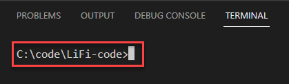

# Getting to know the IDE


For this tutorial, I am assuming that you use [PythonAnywhere](https://www.pythonanywhere.com/). All descriptions and screenshots will be made for and from this environment.


## The Dashboard

The dashboard gives you an overview of your PythonAnywhere (PA) account and your activities. Below is a screenshot of my dashboard.

.png>)

The dashboard is divided into 4 different sections. In the screenshot, I highlighted the "Files" section, which is the most important section for us in this tutorial. By default, you will see your recently edited files, as well as two buttons to open (or create) another file and to browse all existing files.

For now, we don't have to deal with the other three sections. We will introduce them later when we need them.

## Creating Files

When you just signed up the first thing you need to do is to create a new file. To do that, navigate to the "Files" view. You'll see all your directories on the left hand side and the files in the current directory on the right hand side. From here, you can create a new directory by entering a name and then clicking "New directory". Once the directory is created, click on it to create a new file in it. You can do that by entering the file name and then clicking "New file".

As an example, create a new folder called "workbench" and a new file with the name "hello.py" within that folder.

## Editing Files

In order to edit or run an existing program, you need to find the file using the "Files" section. There are two ways to open a file in the editor:

1. If the file is listed under the recent files, just click on the link and the editor will open
2. If the file is not in the recent files list, click on "Browse files". This opens a new view with a list of the directories on the left and the contained files on the right hand side. You can navigate your directories by clicking on them to list the files they contain. Once you found the file you want to edit, click on it and it'll open.

When you open a file, you should see the content in the editor, ready for you to start coding:

.png>)

PA's code editor is quite simplistic, but it comes with the most important features you need to code in Python:

* Syntax highlighting: Python commands are shown in blue, strings in green, etc. This makes the code much better readable
* Auto indent: When you open a new block (we'll learn later what that means), the editor will automatically indent the following commands to make them part of that new block.
* Code completion: When you type a letter (or two or more) and hit Ctrl + Space, the editor gives you suggestions of commands and variables. Hitting enter will complete the text for you.

## Running Programs

When you're done editing, it's time to run your program to see if it does what you expect it to do. Running your program is as simple as clicking the ">>> Run" button in the upper right corner of the editor. You can also use the shortcut **Ctrl + R** to save and run your program.

After you clicked the button, a new console will open that shows the output of your program. You can create an output on the console using the `print()` command, as shown in the screenshot above.


In the free version of PythonAnywhere, you can only have two consoles open at the same time. If you have already two consoles open and you try to run another program, which would open a third console, you get an error message. In this case, navigate to the consoles overview using the burger menu in the upper right corner of the editor. In this view, you see all your open consoles, and you can kill them from there as well.

